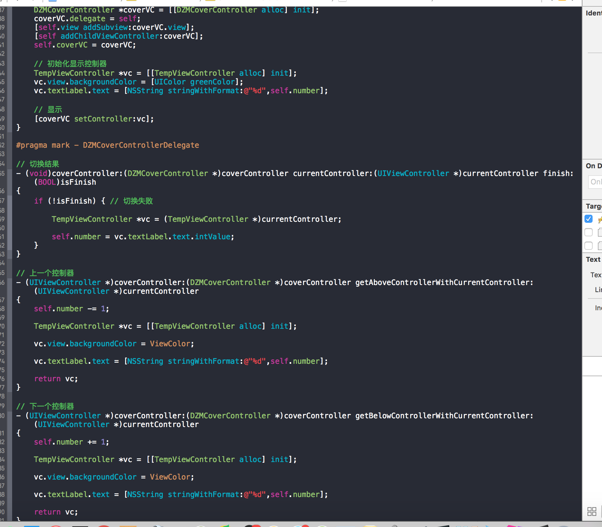

# DZMCoverAnimation

***
#### 简介：

    iOS小说阅读《覆盖翻页》效果:
    
    支持控制器切换,也支持View切换
    
    使用代码,模仿系统的 UIPageController 模式使用
    
    注意: 打开工程默认是支持控制器切换的,右键 -> ShowFinder,进去有针对View切换的,因为文件名一样,只能同时存在一个文件夹

    (控制器覆盖效果 以及 View视图覆盖效果 两者功能一致)

    支持Swift混编 - Xcode7.3.1编写

***
#### 覆盖效果:

***
#### 控制器 - 全屏覆盖效果：

***
#### 控制器 - 自定义Frame - 自定义按钮翻页:

***
#### View - 覆盖效果:

